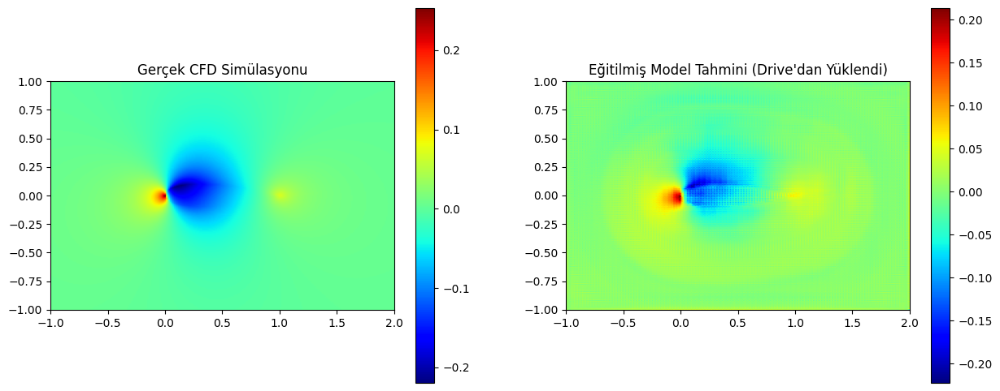

# AeroML: Physics-Aware Deep Learning for Airfoil Aerodynamics

This repository contains a PyTorch-based Deep Residual U-Net (ResUNet) implementation designed to predict pressure and velocity fields around 2D NACA airfoils. It serves as a data-driven surrogate model for traditional Computational Fluid Dynamics (CFD) solvers, offering millisecond-level inference times.

## Overview
Traditional CFD simulations (e.g., OpenFOAM, ANSYS) are computationally expensive and time-consuming. This project leverages a custom ResUNet architecture trained on the **AirfRANS** dataset to instantly map geometric constraints and freestream conditions to aerodynamic scalar and vector fields.

By injecting physical boundary conditions directly into the input tensors, the model accurately captures stagnation points, suction regions, and wake profiles without explicitly solving the Navier-Stokes equations.

## Model Architecture
The network is built upon a standard U-Net backbone but integrates **Residual Blocks** with skip connections to mitigate the vanishing gradient problem during deep feature extraction. 

**Input (3 Channels):**
1. Signed Distance Field (SDF) of the airfoil geometry.
2. Freestream Velocity in X-axis ($U_x$).
3. Freestream Velocity in Y-axis ($U_y$ - representing the Angle of Attack).

**Output (3 Channels):**
1. Normalized Pressure Field ($p$).
2. Velocity in X-axis ($U_x$).
3. Velocity in Y-axis ($U_y$).

## Results (100 Epochs)
The current weights were trained for 100 epochs using the AdamW optimizer and a Cosine Annealing Learning Rate Scheduler.


*Left: Ground Truth (OpenFOAM CFD simulation). Right: AeroML ResUNet Prediction (Inference time: ~40ms on T4 GPU).*

## Repository Structure
- `src/model.py`: Contains the standalone `AeroResUNet` PyTorch class.
- `notebooks/airfRANS.ipynb`: The primary Jupyter notebook containing the data preprocessing, training loop, and evaluation scripts.
- `assets/`: Image resources for documentation.

## How to Run

**1. Clone the repository:**
```bash
git clone [https://github.com/YOUR_GITHUB_USERNAME/AeroML_ResUNet.git](https://github.com/YOUR_GITHUB_USERNAME/AeroML_ResUNet.git)
cd AeroML_ResUNet