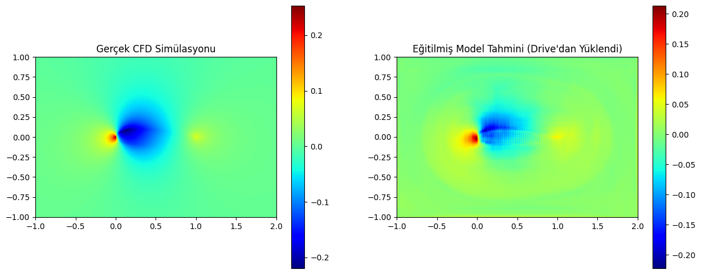

# AeroML: Physics-Aware Deep Learning for Airfoil Aerodynamics

This repository contains a PyTorch-based Deep Residual U-Net (ResUNet) implementation designed to predict pressure and velocity fields around 2D NACA airfoils. It serves as a data-driven surrogate model for traditional Computational Fluid Dynamics (CFD) solvers, offering millisecond-level inference times.

## Overview
Traditional CFD simulations (e.g., OpenFOAM, ANSYS) are computationally expensive and time-consuming. This project leverages a custom ResUNet architecture trained on the **AirfRANS** dataset to instantly map geometric constraints and freestream conditions to aerodynamic scalar and vector fields.

By injecting physical boundary conditions directly into the input tensors, the model accurately captures stagnation points, suction regions, and wake profiles without explicitly solving the Navier-Stokes equations.

## Model Architecture
The network is built upon a standard U-Net backbone but integrates **Residual Blocks** with skip connections to mitigate the vanishing gradient problem during deep feature extraction. 

**Input (3 Channels):**
1. Signed Distance Field (SDF) of the airfoil geometry.
2. Freestream Velocity in X-axis ($U_x$).
3. Freestream Velocity in Y-axis ($U_y$ - representing the Angle of Attack).

**Output (3 Channels):**
1. Normalized Pressure Field ($p$).
2. Velocity in X-axis ($U_x$).
3. Velocity in Y-axis ($U_y$).

## Results (100 Epochs)
The current weights were trained for 100 epochs using the AdamW optimizer and a Cosine Annealing Learning Rate Scheduler.


*Left: Ground Truth (OpenFOAM CFD simulation). Right: AeroML ResUNet Prediction (Inference time: ~40ms on T4 GPU).*

## Repository Structure
- `src/` — FastAPI inference backend:
  - `model.py` — the standalone `AeroResUNet` PyTorch class.
  - `main.py` — REST API (`/predict`, `/predict/raw`, `/health`, `/samples/catalog`).
  - `inference.py` — model loading, cold-start caching, input-tensor construction.
  - `renderer.py` — server-side heatmap rendering.
  - `sdf.py` — analytical NACA 4-digit SDF generator.
- `frontend/` — React + Vite web app (client-side canvas renderer, particle flow).
- `mobile/` — React Native + Expo app (WebView-based renderer).
- `notebooks/airfRANS.ipynb` — data preprocessing, training loop, and evaluation.
- `scripts/` — data utilities (`compress_sdfs.py` builds the SDF cache).
- `docs/` — project documentation.
- `Dockerfile`, `docker-compose.yml` — containerized deployment.
- `aero_resunet_v2_perfect.pth` — trained model weights (ships with the repo).

## How to Run

**1. Clone the repository:**
```bash
git clone https://github.com/AlperenYasemin/AeroML_ResUNet.git
cd AeroML_ResUNet
```

**2. Backend (FastAPI inference server):**
```bash
pip install -r requirements.txt
uvicorn src.main:app --host 0.0.0.0 --port 8000
```
The API is then available at `http://localhost:8000` (interactive docs at `/docs`).

**3. Web frontend:**
```bash
cd frontend
npm install
npm run dev
```
By default the web app targets the hosted cloud API. To point it at your local
backend, create `frontend/.env.local` with:
```
VITE_API_URL=http://localhost:8000
```

**4. Mobile app:**
```bash
cd mobile
npm install
npx expo start          # scan the QR code with Expo Go
```
Use the in-app **Server Configuration** dialog to point it at your local backend
(e.g. `http://<your-LAN-ip>:8000`).

**5. (Optional) Everything in one container:**
```bash
docker compose up --build        # serves API + web on http://localhost:8000
```

## Data & Model Setup

The trained weights (`aero_resunet_v2_perfect.pth`) ship with the repository, so
the backend runs out of the box. The following large artifacts are **not** version
controlled (size / GitHub limits) and must be generated locally if you need them:

| Artifact | Size | Purpose |
|----------|------|---------|
| `AirfRANS_Dataset/` | ~15 GB | Raw AirfRANS dataset (downloaded by the notebook). |
| `tensordata/` | ~1.5 GB | Preprocessed `[3, 256, 256]` input/target tensors. |
| `sdf_cache.pt` | ~100 MB | Compact SDF cache used to serve real training airfoils. |

Without `sdf_cache.pt`, the backend still works — it falls back to **analytical
NACA generation** (the "Custom NACA" mode in the UI). To additionally enable the
**"Training Data"** mode (real airfoils from the dataset), regenerate the cache:

```bash
# 1. Run the preprocessing cells in notebooks/airfRANS.ipynb.
#    This downloads AirfRANS and writes tensordata/train + tensordata/test.

# 2. Compress the per-sample SDFs into a single cache file:
python scripts/compress_sdfs.py        # produces sdf_cache.pt in the project root
```

On startup the backend loads `sdf_cache.pt` if present; otherwise it falls back to
the individual files in `tensordata/train`, and finally to analytical generation.